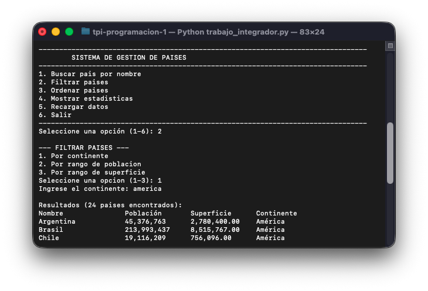
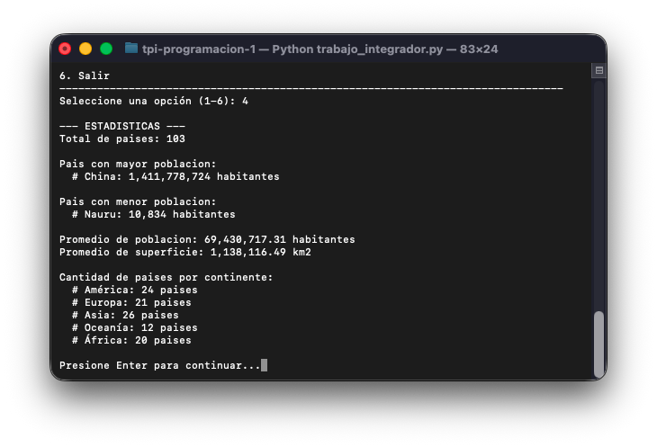

# Trabajo Integrador Programación 1

## Descripción del programa

El Sistema de Gestión de Países es un programa en Python que permite administrar y analizar información de distintos países almacenada en un archivo CSV.
A través de un menú interactivo, el usuario puede:

	-	Buscar países por nombre (coincidencia parcial o exacta).
	-	Filtrar países por continente, población o superficie.
	-	Ordenar la lista de países según diferentes criterios.
	-	Calcular estadísticas básicas (como país con mayor y menor población, promedios y cantidad de países por continente).
	-	Recargar los datos del archivo CSV en cualquier momento.

Desarrollada en Python que permita gestionar información, aplicando listas, diccionarios, funciones, estructuras condicionales y repetitivas, ordenamientos y estadísticas.

## Instrucciones de uso

Requisitos previos

	-	Tener instalado Python 3.8 o superior.
	-	Colocar el archivo paises.csv en la misma carpeta del programa principal.

El archivo CSV debe tener este formato:

    nombre,poblacion,superficie,continente
    Argentina,45376763,2780400,América
    Japón,125800000,377975,Asia
    Brasil,213993437,8515767,América
    Alemania,83149300,357022,Europa

Ejecución del programa

    - Abrir una terminal o consola en la carpeta donde se encuentra el archivo .py
    - Ejecutar: python3 trabajo_integrador.py
    - Si el archivo CSV existe y es válido, el sistema cargará los datos y mostrará el menu principal.

Opciones del menú

    1. Buscar país por nombre
    2. Filtrar países
    3. Ordenar países
    4. Mostrar estadísticas
    5. Recargar datos
    6. Salir

## Ejemplos de entradas y salidas

Capturas de pantalla de ejemplos de ejecucion del programa

